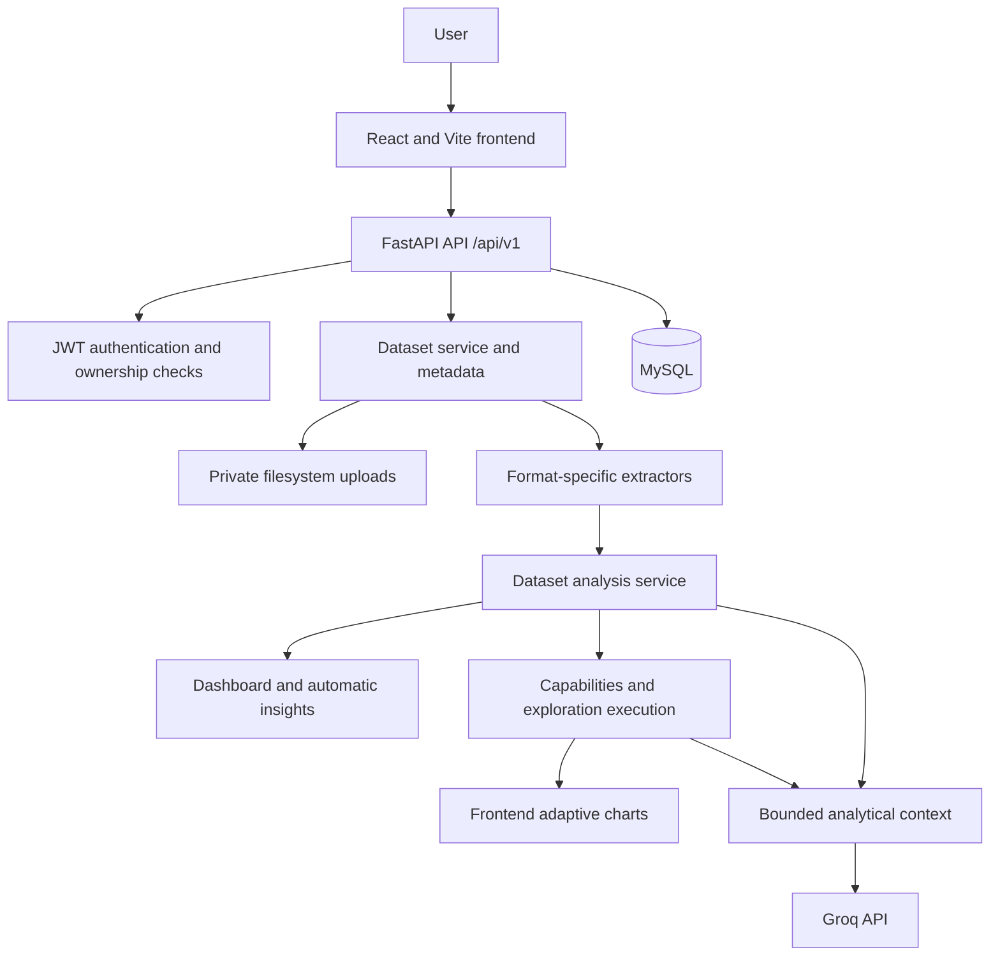

# Architecture

## System Overview



The diagram shows the principal request and data relationships. Extraction and analysis run in the backend request path; the application does not currently define a background worker or separate analytics service.

## Responsibilities

- `frontend/` contains the React application, routes, authentication/theme contexts, API client, dashboards, exploration UI, AI chat, and report presentation/download.
- `backend/app/api/` defines the `/api/v1` routers. Route handlers authenticate protected requests, enforce ownership, call services, and translate expected failures to HTTP errors.
- `backend/app/core/` provides security, constants, logging, and shared exception behavior. `backend/app/config.py` loads environment settings and validates production settings.
- `backend/app/services/` owns upload persistence, extraction, dataset analysis, dashboard and insight construction, exploration capabilities/execution, and AI context/provider calls.
- `backend/app/schemas/` defines validated request and response contracts.
- `backend/app/models/` and `backend/app/db/` define SQLAlchemy models, engine/session, and metadata.
- `backend/migrations/` contains Alembic configuration and schema history.
- `backend/tests/` contains API, unit, and extractor tests.
- `docker-compose.yml` starts an optional local MySQL service only. `backend/Dockerfile` packages the API; it does not provision MySQL, persistent upload storage, or migrations automatically.

## Dataset Lifecycle

```text
Upload -> validate extension and size -> generated private storage name
       -> create owner-linked dataset metadata in MySQL
       -> extract tabular content -> normalize values and columns
       -> profile and analyze -> dashboard and automatic insights
       -> exploration capabilities -> filtered/aggregated exploration
       -> bounded analysis context -> optional Groq answer or report
```

The upload endpoint stores the original file and creates metadata. Extraction and analysis are performed when analysis, insights, exploration, or AI endpoints request them; analysis output is not persisted as a separate materialized result. Dataset rows and uploaded files are associated through dataset metadata and owner ID.

## Dataset-Driven Analysis

The analysis pipeline profiles columns and classifies likely roles such as numeric, categorical, datetime, text, identifier, boolean, or unknown. It computes numeric and categorical summaries, missingness, duplicates, correlations, and dashboard-ready distributions, relationships, and trends where the detected columns support them. Exploration capabilities are derived from the same analysis rather than a fixed domain schema.

These are inferred roles, not semantic guarantees. High-cardinality and identifier-like columns may not be useful as group dimensions. Dates must parse successfully to support time analysis. Missing and ambiguous values affect available calculations. Correlation indicates association, not causation.

## File Ingestion

The upload API first validates the filename extension against `.csv`, `.xlsx`, `.txt`, `.docx`, and `.pdf`; the extractor factory selects the corresponding implementation. The factory also recognizes PDF and Office ZIP signatures when called with an extensionless/unrecognized path, but the upload endpoint itself rejects unsupported extensions before extraction.

| Format | Extraction and normalization |
|---|---|
| CSV | Reads a sample to sniff comma, semicolon, tab, or pipe delimiters (comma fallback), then parses the file with Pandas. UTF-8 with BOM and Latin-1 samples are recognized. |
| XLSX | Reads worksheets in workbook order and uses the first non-empty worksheet. |
| TXT | Reads UTF-8 with BOM or Latin-1 and splits lines on a detected comma, tab, semicolon, or pipe delimiter; a first row is used as column headers. |
| DOCX | Reads Word tables, treats each table's first row as headers, and combines usable tables. Paragraph prose is not converted to rows. |
| PDF | Uses pypdf to extract embedded page text and recognizes delimiter-separated lines as table rows. It does not perform OCR. |

All extractors pass their DataFrame through common normalization: blank headers receive generated names, whitespace-only cells become missing values, all-empty rows are removed, and sufficiently numeric/date-like columns are converted. Numeric conversion requires at least 80% of non-missing values to parse; date conversion is attempted for columns that do not meet that numeric threshold and requires at least 70% to parse. Format-specific layout limitations are listed in [limitations](limitations.md).

## Persistence and Trust Boundaries

MySQL stores user and dataset records. The backend filesystem stores uploaded files in `UPLOAD_DIRECTORY`; configure durable private storage in production and do not expose it as a public static directory. The frontend sends bearer tokens to the API. The Groq key and provider calls remain server-side. AI context is produced by backend code from bounded analysis summaries and optional bounded exploration details, not by sending unlimited raw dataset rows.